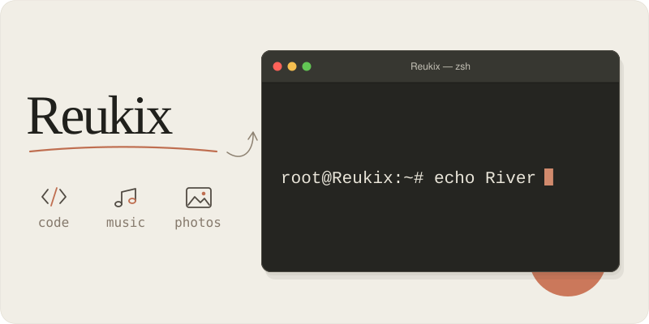

<h1 align="center">Reukix</h1>

  编程、听歌、摄影，还有睡觉。 
  <code>root@Reukix:~# ln -s River ~/home</code>

  <a href="https://github.com/Reukix?tab=repositories" title="查看仓库">
    <picture>
      <source media="(prefers-color-scheme: dark)" srcset="./assets/repositories-dark.svg" />
      
    </picture>
  </a>
  &nbsp;&nbsp;&nbsp;
  

<h3>
  一些项目
  <picture>
    <source media="(max-width: 600px)" srcset="./assets/hero-mobile.svg" width="600" />
    
  </picture>
</h3>

  <a href="https://github.com/RegramDev/Regram-ios"><strong>Regram-ios ↗</strong></a> 
  Telegram 的第三方 iOS 客户端。 支持消息过滤、翻译和界面定制。

  <a href="https://github.com/Reukix/ukix"><strong>ukix ↗</strong></a> 
  自用的网络规则、代理配置和服务器脚本。

  <a href="https://github.com/Reukix/img-up-bot"><strong>img-up-bot ↗</strong></a> 
  给 Telegram 机器人发文件，拿到图床链接。

 

<h3 align="center">GitHub 统计</h3>

  

